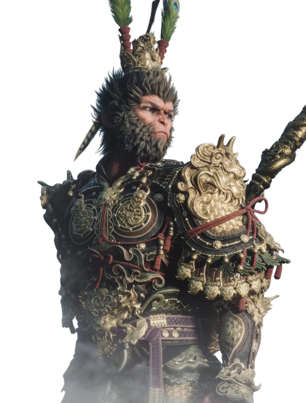
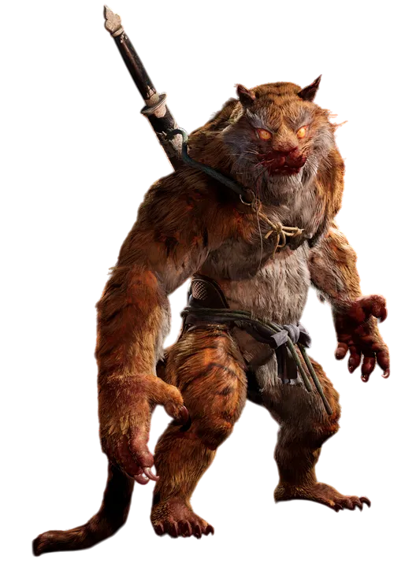
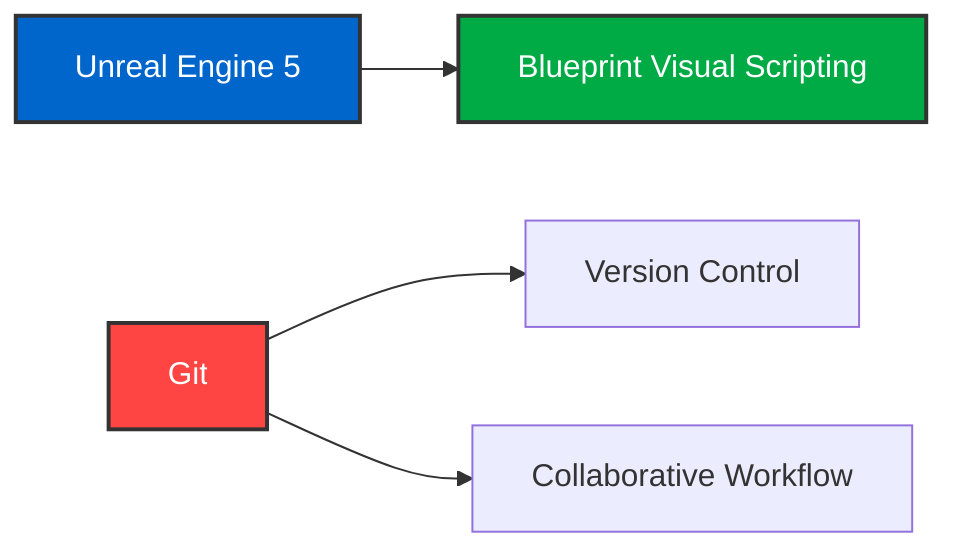

# [검은신화: 오공 호선봉 보스전 모작 프로젝트] 
## ✓ Project Overview

<table border="0" cellspacing="0" cellpadding="8" style="width: 100%; table-layout: fixed;">
  <tr>
    <td style="width: 20%; padding: 8px;"><strong>Project Name</strong></td>
    <td style="padding: 8px;">검은신화: 오공 호선봉 보스전 모작</td>
  </tr>
  <tr>
    <td style="padding: 8px;"><strong>Duration</strong></td>
    <td style="padding: 8px;">2025.07.07 - 2025.08.01 (25 days)</td>
  </tr>
  <tr>
    <td style="padding: 8px;"><strong>Team Size</strong></td>
    <td style="padding: 8px;">2 developers</td>
  </tr>
  <tr>
    <td style="padding: 8px;"><strong>Engine</strong></td>
    <td style="padding: 8px;">Unreal Engine 5</td>
  </tr>
  <tr>
    <td style="padding: 8px;"><strong>Version Control</strong></td>
    <td style="padding: 8px;">Git-based collaborative workflow</td>
  </tr>
  <tr>
    <td style="padding: 8px;"><strong>Purpose</strong></td>
    <td style="padding: 8px;">UE5 게임 개발 역량 향상을 위한 보스전 시스템 모작 프로젝트</td>
  </tr>
</table>

## ✓ Tool & Skill

  
  ### Game Development
  
  
  
  ### Version Control
  
  
  
  

## ✓ Team & Role Distribution

<table align="center">
<tr>
<td align="center" width="50%">

 <strong>조은정</strong> 
<code>[오공]</code>
</td>
<td align="center" width="50%">

 <strong>정하영</strong> 
<code>[호선봉]</code>
</td>
</tr>
</table>

## ✓ Tech Stack & Tools

### Core Technologies

## ✓ 최종 결과물
<table align="center" border="0">
  <tr>
    <td align="center">
       
    </td>
  </tr>
</table>
- 원작: https://store.steampowered.com/app/2358720/Black_Myth_Wukong/  
- 모작: https://cafe.naver.com/f-e/cafes/29357654/articles/32077?boardtype=L&menuid=64&referrerAllArticles=false

## ✓ KPT 회고
<table border="1" cellspacing="0" cellpadding="8">
  <tr>
    <td><strong>KEEP</strong></td>
    <td>
      <ul>
        <li>적극적으로 프로젝트에 참여</li>
        <li>프로토타입 단계부터 일관된 Git 버전 관리 체계를 유지하며 협업 기반을 안정적으로 구축</li>
        <li>기술적인 어려움이 있었지만, 끝까지 포기하지 않고 해결 방법을 탐색</li>
        <li>성과 창출을 위해 지속적으로 개선 방안을 모색</li>
        <li>작업 영역을 명확하게 분리하고 책임 부여한 구조로 각자 역할에 대해 오너십을 가지고 진행</li>
      </ul>
    </td>
  </tr>
  <tr>
    <td><strong>PROBLEM</strong></td>
    <td>
      <ul>
        <li>언리얼과 게임 개발에 대한 사전 이해 부족으로 구조 없는 개발을 진행하게 되었고, 툴 적응에도 시간이 걸려 완성도와 효율성 측면에서 아쉬움</li>
        <li>정기적인 커뮤니케이션 루틴 부재로 인한 협업 흐름 저하</li>
        <li>메모리 효율을 고려하지 않고 에셋을 과도하게 사용한 결과, 버그 및 퍼포먼스 저하가 발생</li>
        <li>초기 기획이 명확히 정리되지 않아 구현 시 의도 전달에 오류가 생기고, 반복적인 수정이 필요</li>
      </ul>
    </td>
  </tr>
  <tr>
    <td><strong>TRY</strong></td>
    <td>
      <ul>
        <li>애자일 방식을 적용하여 매일 아침 스크럼 회의를 통해 진행 상황을 공유하고, 우선순위를 유동적으로 조정하며 유연한 개발 환경 유지</li>
        <li>기획 단계에서 기술 구현 방식까지 구체적으로 설계하여, 단순 아이디어 공유가 아니라 실제 구현 방식 (사용할 구조, 예외 처리, 설계 방식 등)까지 문서나 회의로 정리</li>
        <li>에셋 사용 시 용량과 최적화 여부를 사전에 검토하고, LOD(Level of Detail), 스트리밍, 압축 등의 기능을 적극 활용하여 메모리 효율을 고려한 자산 관리 방식을 적용</li>
      </ul>
    </td>
  </tr>
</table>
